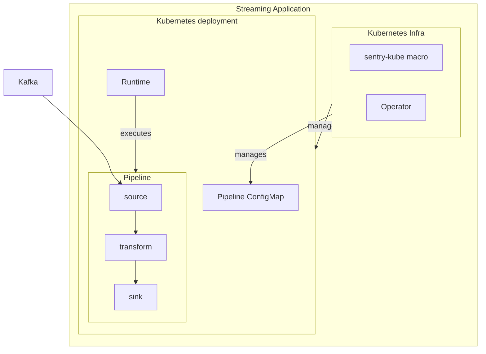

# streams

The Sentry Streaming Platform

Sentry Streams is a distributed platform that, like most streaming platforms,
is designed to handle real-time unbounded data streams.

This is built primarily to allow the creation of Sentry ingestion pipelines
though the api provided is fully independent from the Sentry product and can
be used to build any streaming application.

The main features are:

- Kafka sources and multiple sinks. Ingestion pipeline take data from Kafka
  and write enriched data into multiple data stores.

- Dataflow API support. This allows the creation of streaming application
  focusing on the application logic and pipeline topology rather than
  the underlying dataflow engine.

- Support for stateful and stateless transformations. The state storage is
  provided by the platform rather than being part of the application.

- Hide the Kafka details from the application. Like commit policy and topic
  partitioning.

- Out of the box support for some streaming applications best practices:
  DLQ, monitoring, health checks, etc.

- Support for Rust and Python applications.

- Support for multiple runtimes.

[Streams User Documentation](https://getsentry.github.io/streams/)

## Architecture of a Streaming Application

The three main components of a streaming application built with this library are:

* The pipeline itself written via the Pipeline DSL. This represents the application logic.

* The runtime. This is the binary that executes the pipeline primitives and processes data.

* The Kubernetes infrastructure to deploy the pipeline (when on Kubernetes).

Pipeline and runtime architecture docs are [here](./sentry_streams/docs/architecture/README.md)

The pipeline DSL allows the user to define the streaming pipeline through a set
of dataflow primitives chained together. This is a Python DSL now.

The application logic is separate from the infrastructure configuration which
is provided as a separate yaml file. The config file covers aspects like
observability, scale, parallelism, tuning, etc. This is meant to separate
the application logic from infra.

The Runtime consumes the pipeline defined above and the config file, manages
the connectivity with Kafka and executes the processing in a supposedly optimized
way.

The platform is provided as a Python package that contains also a native
portion as the runner. This package (`sentry_streams`) is imported by the application
code. The application defines the pipeline in its own code base and then uses
the runner provided by the library for the execution.

This system provides the infrastructure needed to run the application in Kubernetes.
There are two options:

* A [Sentry Kube](https://github.com/getsentry/sentry-infra-tools#sentry-kube) macro.
  This can be used to generate Deployments and Configmap manifests to deploy manually

* An experimental operator that manages a pipeline as a CRD.

## to develop in this repo

`cd` into the `streams`, the repo should automatically set up your development environment for you. Make sure to regularly run `direnv allow` since we iterate on the devenv quite a bit.

You can use `make reset` to remove almost all installed artifacts.

Run `gcloud auth application-default login` if interacting with GCP.

## Troubleshooting

### CMake Error

If encountering "CMake Error at CMakeLists.txt:1 (cmake_minimum_required): Compatibility with CMake < 3.5 has been removed from CMake.",
run `export CMAKE_POLICY_VERSION_MINIMUM=3.5` before running `make install-dev`.

Note: The `.envrc` should already set this for you. If you don't have this environment variable then you don't have direnv setup correctly.

### spurious changes to uv.lock

Those are usually okay to check in. Run `uv self update` to be sure that this is how the latest UV does things.
