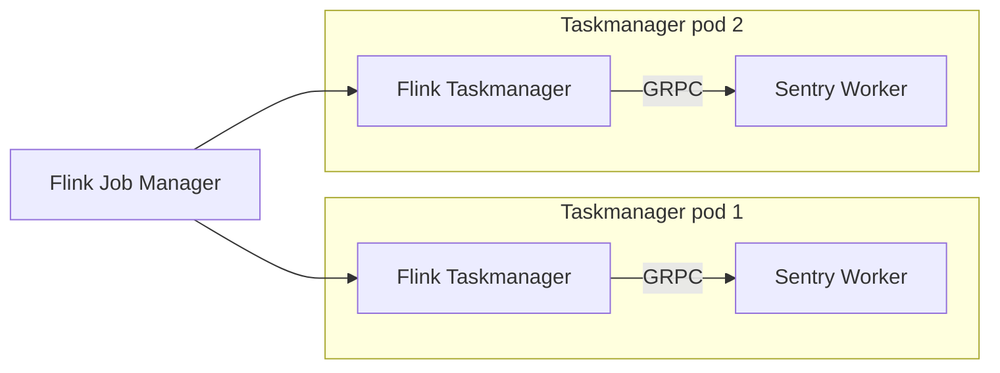
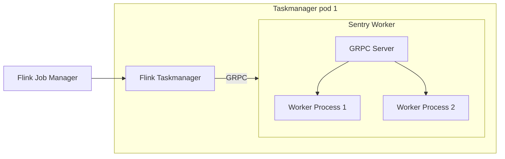

Flink Bridge
=============

This is a Hackweek project to see if we can decouple the application logic
from the Flink processing pipeline in a performant way.

If we can do these:
- Run the applicaiton logic in a GRPC server
- Do it in a performant way (PyFlink already does this)
- Preserve the same delivery guarantee and state management semantics.

then Flink would be a much more palatable options as we will be able to:
- Run application logic in whatever language
- Avoid packaging Flink in the same docker image as the monolith
- Potentially restart the application logic without restarting the pipeline
- - This would be tricky as it may compromise the guarantee of delivery semantics.

This doc keeps track of the state of the project.

## Architecture

This is how the system would work. Let's keep it simple first and assume
each Flink taskmanager has one slot only.



Though in practice each taskmanager has multiple slots that have to run in separate
processes or python workers would compete for the GIL

So we may end up with something like this



Currently there are two components:

- flink_worker. This is a Python GRPC service that serves as a stub for the real service
- flink_bridge. This is a Java Flink application that uses Datastream API V2 from FLink 2.21 Which serves as client.


HOW TO RUN IT
=============

1. Downlaod Flink 2.1 and start a local cluster

```
./bin/start-cluster.sh
```

2. Install Java 21 and Maven. Then compile the application

```
cd flink_bridge
mvn package
```

3. generate the YAML config for Flink

```
cd sentry_streams
uv sync
python -m sentry_streams.runner \
    -n SimpleMap \
    --adapter flink_pipeline \
    --config ~/code/streams/sentry_streams/sentry_streams/deployment_config/simple_batching_grpc.yaml \
    ~/code/streams/sentry_streams/sentry_streams/examples/simple_batching.py > /tmp/pipeline_desc.yaml
```

This creates a YAML file that Flink consumes to compose the pipeline

4. start the GRPC worker

```
cd flink_worker
uv sync
python -m sentry_streams.runner \
    -n SimpleMap \
    --adapter grpc_worker \
    --config ~/code/streams/sentry_streams/sentry_streams/deployment_config/simple_batching_grpc.yaml \
    ~/code/streams/sentry_streams/sentry_streams/examples/simple_batching.py
```

5. Start the Flink application

```
./bin/flink run \
  ~/code/streams/flink_bridge/target/flink-bridge-app.jar \
  --pipeline-name /tmp/pipeline_desc.yaml
```

6. Look at the stdout of the taskmanager. You find logs and stdout here

```
filippopacifici@MacBookPro log % pwd
/Users/filippopacifici/code/flink-2.1.0/log
filippopacifici@MacBookPro log % ls
flink-filippopacifici-client-.local.log
flink-filippopacifici-standalonesession-0-.local.log
flink-filippopacifici-standalonesession-0-.local.log.1
flink-filippopacifici-standalonesession-0-.local.out
flink-filippopacifici-standalonesession-1-.local.log
flink-filippopacifici-standalonesession-1-.local.log.1
flink-filippopacifici-standalonesession-1-.local.out
flink-filippopacifici-taskexecutor-0-.local.log
flink-filippopacifici-taskexecutor-0-.local.log.1
flink-filippopacifici-taskexecutor-0-.local.log.2
flink-filippopacifici-taskexecutor-0-.local.out
```

TODO
====


Port the GRPC service to Rust
--------------

We started with a Python one to make it easy. Our worker will be rust and able
to call iunto python as we do with the arroyo adapter.

- Add a worker abstraction in rust that stays in between arroyo and the python code
- Create the Rust GRPC server and use that abstraction to call into applicaiton code
  so we can reuse all the work we did for the existing pipeline


Test redeployment
--------

Can we even make the system survive a redeployment ?

Load test
-------

Package everything in Docker images and run it in sandbox
