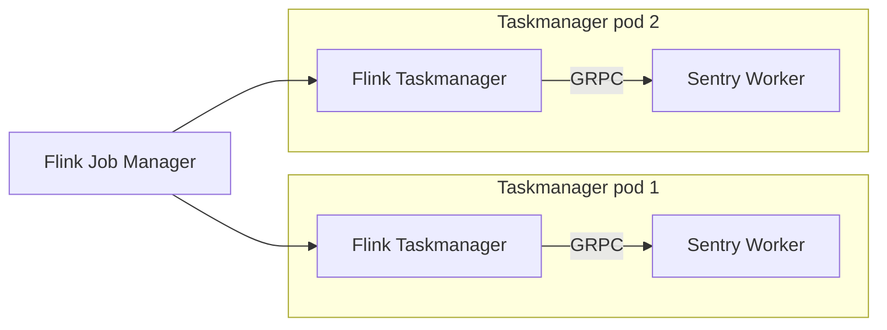
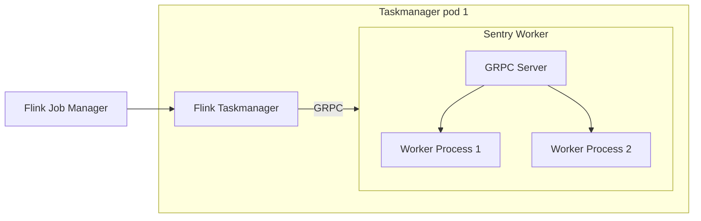

Flink Bridge
=============

This is a Hackweek project to see if we can decouple the application logic
from the Flink processing pipeline in a performant way.

If we can do these:
- Run the applicaiton logic in a GRPC server
- Do it in a performant way (PyFlink already does this)
- Preserve the same delivery guarantee and state management semantics.

then Flink would be a much more palatable options as we will be able to:
- Run application logic in whatever language
- Avoid packaging Flink in the same docker image as the monolith
- Potentially restart the application logic without restarting the pipeline
- - This would be tricky as it may compromise the guarantee of delivery semantics.

This doc keeps track of the state of the project.

## Architecture

This is how the system would work. Let's keep it simple first and assume
each Flink taskmanager has one slot only.

Though in practice each taskmanager has multiple slots that have to run in separate
processes or python workers would compete for the GIL

So we may end up with something like this

Currently there are two components:

- flink_worker. This is a Python GRPC service that serves as a stub for the real service
- flink_bridge. This is a Java Flink application that uses Datastream API V2 from FLink 2.21 Which serves as client.

TODO
====

[Filippo] Full GRPC interface
-----------------------

We need a GRPC interface that would support both stateful and stateless applications
with the proper delivery guarantees.
For stateless applications this is trivial. We just need to get message in and return
messages.
For stateful applications things are more complex as we need to intercept the signals
from Flink about windowing and checkpoints.

- Enrich the Message structure with the segment and the pipeline
- Handle time, window and checkpoint. Prove it can work to do batching in memory
- handle persistent state

Port the GRPC service to Rust
--------------

We started with a Python one to make it easy. Our worker will be rust and able
to call iunto python as we do with the arroyo adapter.

- Add a worker abstraction in rust that stays in between arroyo and the python code
- Create the Rust GRPC server and use that abstraction to call into applicaiton code
  so we can reuse all the work we did for the existing pipeline

Create a StreamingAdapter that starts the GRPC worker instead of an arroyo consumer
----

Let's wire this up to the platform.

- Sink, source, router and broadcast come from Flink. Do not port it. Everything
  else is chained together into processing segments that are served by the GRPC server
- Start the GRPC server to serve a pipeline.

Create an adapter that produces a yaml file with the pipeline topology
-----------

We do not want sentry_streams to import flink so we are going to dump a yaml
description of hte applicaiton and the Java code will load that

- Create an adapter that dumps the yaml
- Update the Flink JAva application to load the YAML and compose the pipeline
  delegating the processing steps to the GRPC service

Test redeployment
--------

Can we even make the system survive a redeployment ?

Load test
-------

Package everything in Docker images and run it in sandbox
