Flink Bridge
=============

This is a Hackweek project to see if we can decouple the application logic
from the Flink processing pipeline in a performant way.

If we can do these:
- Run the applicaiton logic in a GRPC server
- Do it in a performant way (PyFlink already does this)
- Preserve the same delivery guarantee and state management semantics.

then Flink would be a much more palatable options as we will be able to:
- Run application logic in whatever language
- Avoid packaging Flink in the same docker image as the monolith
- Potentially restart the application logic without restarting the pipeline
- - This would be tricky as it may compromise the guarantee of delivery semantics.

This doc keeps track of the state of the project.

## Architecture

This is how the system would work. Let's keep it simple first and assume
each Flink taskmanager has one slot only.


Though in practice each taskmanager has multiple slots that have to run in separate
processes or python workers would compete for the GIL

So we may end up with something like this

```mermaid
graph LR
    job_manager[Flink Job Manager]
    subgraph taskmanager1 [Taskmanager pod 1]
        subgraph worker [Sentry Worker]
            grpc[GRPC Server]
            workerp1[Worker Process 1]
            workerp2[Worker Process 2]
            grpc --> workerp1
            grpc --> workerp2
        end
        manager1[Flink Taskmanager] --GRPC--> worker

    end
    job_manager --> manager1

```



Adapter and server
-----------------

There are mainly two components in this architecture: the Flink Application and the GRPC server.

The Flink application is a Java Flink application that is provided the configuration of the
pipeline and sets up the sequence of Flink operator that do either local processing or
delegates to the Grpc server.

The Grpc server contains the application logic and execute the processing both in
a stateful or stateless way.

The Flink application does not contain any application specific code. A dedicated
Streaming adapter inspects the pipeline definition and produces a yaml descriptor
that is passed to the Flink application when it starts. From the yaml file, the
Flink Application knows when to send data to the Grpc Server

The Grpc server is started by the runner using a different adapter. This adapter
reads the same pipeline definition.

The pipeline is divided into segments. A segment contains a sequence of steps
to be processed in a single request to the Grpc server. A segment is closed
and a new one is opened in these scenarios:

- parallelism changes
- reshuffling is needed
- routing is needed
- we reached a sink.

Every request from the Flink application to the Grpc server contains the segment id
as a parameter so the Grpc server knows which segment to send data to.

Each segment is implemented as a `ChainSegment` object which contains a sequence of
steps, each step contains the application logic.

The Flink Application is also expected to forward watermark messages to the Grpc
Server so that the Server can decide when to close batches or manage state.


Data processing
--------------

Each message is dceserialized from bytes into a Message structure in the bridge
then it is send to the server where it is sent through a sequence of steps.

Multiple pipeline steps are chained in the same GRPC call to reduce the back and
forth. As long as we are not reshuffling data we run steps in the same chain.

THe server can return multiple messages for each message sent. The batch is sent
back as a sequence of messages which are then serialized and sent to the sink.


Currently there are two components:

- flink_worker. This is a Python GRPC service that serves as a stub for the real service
- flink_bridge. This is a Java Flink application that uses Datastream API V2 from FLink 2.21 Which serves as client.


HOW TO RUN IT
=============

1. Downlaod Flink 2.1 and start a local cluster

```
./bin/start-cluster.sh
```

2. Install Java 21 and Maven. Then compile the application

```
cd flink_bridge
mvn package
```

3. generate the YAML config for Flink

```
cd sentry_streams
uv sync
python -m sentry_streams.runner \
    -n SimpleMap \
    --adapter flink_pipeline \
    --config ~/code/streams/sentry_streams/sentry_streams/deployment_config/simple_batching_grpc.yaml \
    ~/code/streams/sentry_streams/sentry_streams/examples/simple_batching.py > /tmp/pipeline_desc.yaml
```

This creates a YAML file that Flink consumes to compose the pipeline

4. start the GRPC worker

```
cd flink_worker
uv sync
python -m sentry_streams.runner \
    -n SimpleMap \
    --adapter grpc_worker \
    --config ~/code/streams/sentry_streams/sentry_streams/deployment_config/simple_batching_grpc.yaml \
    ~/code/streams/sentry_streams/sentry_streams/examples/simple_batching.py
```

5. Start the Flink application

```
./bin/flink run \
  ~/code/streams/flink_bridge/target/flink-bridge-app.jar \
  --pipeline-name /tmp/pipeline_desc.yaml
```

6. Look at the stdout of the taskmanager. You find logs and stdout here

```
filippopacifici@MacBookPro log % pwd
/Users/filippopacifici/code/flink-2.1.0/log
filippopacifici@MacBookPro log % ls
flink-filippopacifici-client-.local.log
flink-filippopacifici-standalonesession-0-.local.log
flink-filippopacifici-standalonesession-0-.local.log.1
flink-filippopacifici-standalonesession-0-.local.out
flink-filippopacifici-standalonesession-1-.local.log
flink-filippopacifici-standalonesession-1-.local.log.1
flink-filippopacifici-standalonesession-1-.local.out
flink-filippopacifici-taskexecutor-0-.local.log
flink-filippopacifici-taskexecutor-0-.local.log.1
flink-filippopacifici-taskexecutor-0-.local.log.2
flink-filippopacifici-taskexecutor-0-.local.out
```
