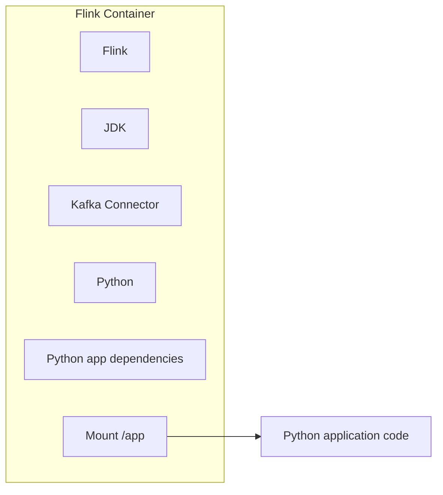

# Apache Flink Development Environment

Our streaming API supports Flink. Flink runs on Java. We do not want to require
every engineer who wants to run a streaming application locally to install a JDK.

This directory contains everything needed to run streaming applications on a
Flink container without needing Java locally on the developer's laptop.
The container packages the Flink distribution, the Kafka connector and the
python dependencies the application needs. It also mounts a local directory
containing the application code to run so that application changes do not require
Docker image to be rebuilt.

## How to use it

This guide explains how to set up a running Flink and deploy an application built
inside the sentry_streams python projects. In order to use this in a different
code base a different image must be built.

1. Create a virtual environment with `make install-dev` (the Makefile is in the
   root of the project). Activate the environment.

2. Ensure you do not have a Kafka running. If you have one stop it.

3. Start the docker-compose bundle in `platforms/flink` and make it rebuild the image:
   `docker-compose up --build`. Add `-d` if you want to run docker compose in
   detached mode.

4. Verify that all containers are running:

```
flink-taskmanager-1
jobmanager
kafka
```

5. Deploy an application with the `flink_deploy.py` script.

From the `sentry_flink/` folder, run:
```
python \
     sentry_flink/flink_runtime/flink_deploy.py \
     -n "My Flink App" \
     sentry_streams/examples/{example_name}.py
```

`-n` is the name you are giving to the Flink application
`sentry_streams/example_config.py` is the file containing the pipeline topology.

Use `-h` parameter for more details.

6. Open `http://localhost:8081` to use the Flink admin interface. From there you can access logs, metrics and application details.

7. Stop the application with the `flink_stop.py` script.

```
python \
     sentry_streams/flink_runtime/flink_stop.py \
     "My Flink App"
```

## The Docker Image

The Flink docker image is a bit complicated.



There are multiple ways to deploy Flink applications. Specifically we are interested
in two of them: package the application together with the Flink image and deploying
the application with the Flink CLI `flink run`.

In production we will certainly package the application with Flink in the same image.
In the development environment this is not viable, so we need to have a locally running
Flink that can access the code base.

Running a Flink server locally with pyFlink means having a JDK. This is a constraint
on the development environment we do not need to have.

We can achieve a similar result by running Flink in a container that has access to the
directory running the application:

- the Docker image needs to contain the Kafka connector JARs. These are downloaded
  when building the image

- The Docker image needs to access the application outside the image so that changes
  to the applications do not require the image to be rebuilt. This is achieved by
  mounting the application directory as a volume.

- We still need to run `flink run` to deplot the image as a Flink Job. `flink run` is
  a Java application. But we can run it inside the Flink container itself.

- The image must contain all the Python dependencies to run the application. It is
  impractical to try to access the dependencies from the virtual environment outside
  the image so we just install all the requirements when building the image.
