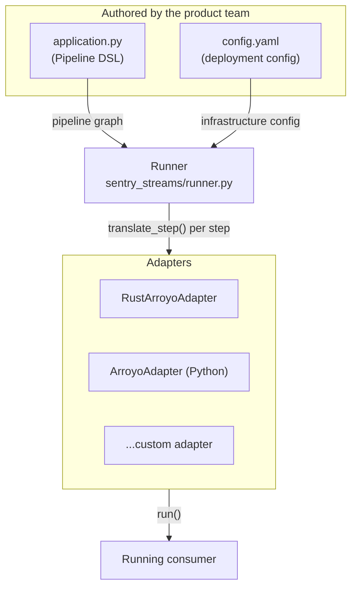

# Sentry Streams Architecture

This directory describes the architecture of the `sentry_streams` package: the roles of
the main subsystems, the decisions behind them, the rules that must hold, and what we
know is unfinished.

# The model

This is the conceptual model the rest of the documentation assumes. Vocabulary is in
the [glossary](./README.md#glossary).

## The three layers

A streaming application built on this platform is made of three independent layers.
The whole design of the package follows from keeping them separate.

**The pipeline DSL** is how a product team describes what their application does. It is
a pure, declarative description of a dataflow graph: a source, a series of
transformations, one or more sinks. It contains no reference to Kafka brokers, thread
counts, consumer groups, or the engine that will run it. An application is a Python
file that builds a `Pipeline` object and assigns it to a module level variable named
`pipeline`.

**The adapter** turns that description into something executable on a specific runtime.
Each adapter implements a common interface, one method per primitive, and is free to
build whatever runtime-specific structure it wants as those methods are called.

**The runner** is the glue and the entry point. It loads the application file and the
deployment configuration, instantiates the requested adapter, walks the pipeline graph
handing each step to the adapter, and tells the adapter to run.

Alongside these there is **the deployment configuration**: a YAML file carrying
everything the pipeline description deliberately left out. It is described once, in
[Deployment configuration](../reference/deployment-config.md).



The key property of this split is that the same application file can be deployed
against different brokers, topics, parallelism settings and even different runtimes
without being modified.

A fourth layer, the Kubernetes deployment automation, lives in the `sentry_streams_k8s`
package. The seam between the two is described in
[Deployment configuration](../reference/deployment-config.md#the-seam-with-sentry_streams_k8s).

## The primitives

The DSL is built from a small set of primitives, in a few families:

- **Sources** produce messages into the pipeline. `StreamSource` reads from a Kafka
  topic. A pipeline has exactly one root source.
- **Transforms** are 1:1 or 1:N operations: `Map`, `PredicateFilter`, `HeadersFilter`,
  `FlatMap`.
- **Reduces** accumulate multiple messages into one over a window: `Batch` for plain
  batching, `Aggregate` for windowed, optionally keyed, accumulator based aggregation.
- **Branching steps** split the stream: `Router` sends each message to exactly one
  downstream branch, `Broadcast` sends a copy to every branch. Both take fully defined
  sub-pipelines built with `branch()`.
- **Sinks** terminate a branch: `StreamSink` produces to Kafka, `GCSSink` writes objects
  to GCS, `DevNullSink` discards. Every branch must end in a sink; the runner validates
  this before anything is built.
- **Complex steps** are higher level primitives that are syntactic sugar over the simple
  ones: `Parser`, `Serializer`, `BatchParser`, `ParquetSerializer`, `Reducer`. See
  [Pipeline DSL and runner](./pipeline-dsl-and-runner.md#complex-steps).

Refer to [pipeline.py](../../sentry_streams/pipeline/pipeline.py) to find documentaiton
on each of the implemented steps.

A pipeline is built by chaining these together. Each step has a name, which is also the
key the deployment config uses to configure that step.

```python
from sentry_kafka_schemas.schema_types.ingest_metrics_v1 import IngestMetric

from sentry_streams.examples.transform_metrics import filter_events, transform_msg
from sentry_streams.pipeline.pipeline import (
    Map,
    Parser,
    PredicateFilter,
    Serializer,
    StreamSink,
    streaming_source,
)

pipeline = streaming_source(name="myinput", stream_name="ingest-metrics")

(
    pipeline.apply(Parser[IngestMetric]("parser"))
    .apply(PredicateFilter("filter", function=filter_events))
    .apply(Map("transform", function=transform_msg))
    .apply(Serializer("serializer"))
    .sink(StreamSink("mysink", stream_name="transformed-events"))
)
```

Notice what is absent: no broker address, no consumer group, no parallelism, no runtime.
`ingest-metrics` and `transformed-events` are logical stream names the deployment config
can override with the physical topics of a given environment.

This snippet is the canonical example. Other documents refer to it rather than repeating
it.

## Build, then run

Building and running are two distinct phases, and the adapter interface is shaped around
that distinction.

During the **build phase** the runner traverses the pipeline graph from the root source,
calling one adapter method per step through a `RuntimeTranslator`. The traversal follows
data flow rather than a list: each method receives the handle of the stream it attaches
to and returns the handle it produces, and branching steps return one handle per branch.
Nothing executes; the adapter accumulates.

During the **run phase** the runner calls `run()` on the adapter, which blocks until the
consumer shuts down.

That these are two separate functions is an invariant, not an implementation detail —
see [Contracts](./contracts.md#the-runner).

## Multiple adapters

The adapter interface is generic in the type of the stream handle, so adapters can
represent "a stream" however their runtime requires. The runner knows nothing about what
flows through it.

The adapter used in production is the **Rust Arroyo adapter** (`rust_arroyo`), documented
in [The Rust Arroyo adapter](./rust-arroyo/README.md).


# Reading paths

**Evolving the platform**

2. [Adding a step](./guides/adding-a-step.md) — the procedure, with anchors and a skeleton.
3. [Contracts and invariants](./contracts.md) — the rules a new step must not break.
4. The [Rust runtime](./rust-arroyo/README.md) page for the area you are touching.

**Architecture**

2. [Guarantees and failure modes](./guarantees.md) — what the system promises.


# Glossary

Several of these words are used in more than one sense elsewhere in the industry, and
two of them are used in more than one sense in this repository.

| Term | Meaning here |
| --- | --- |
| **Step** | A node in the pipeline the application author writes: `Map`, `Batch`, `StreamSink`. |
| **Primitive** | A step type the adapter interface has a method for (`source`, `map`, `filter`, `reduce`, `sink`, `router`, `broadcast`, `flat_map`). |
| **Complex step** | A step that is syntactic sugar: it `convert()`s to simple steps before an adapter sees it. `Parser`, `Serializer`, `Reducer`. |
| **Adapter** | The component that turns a pipeline description into something a specific runtime can execute. |
| **Handle** | Whatever an adapter uses to represent "a stream" while the graph is being walked. Opaque to the runner. For the Rust adapter it is a `Route`. |
| **Route** | A source name plus an ordered list of waypoints. Identifies a branch of the pipeline. |
| **Waypoint** | One branch name appended to a route by a `Router` or `Broadcast`. |
| **Operator** (`RuntimeOperator`) | A Rust-side *descriptor* of something to build. One operator may cover several DSL steps. |
| **Strategy** | An Arroyo `ProcessingStrategy`. What an operator is built into at run time. |
| **Chain** / **fusion** | Consecutive `Map` steps accumulated by the adapter and composed into a single function. |
| **Delegate** | A Python object implementing `RustOperatorDelegate`, driven by the Rust `PythonAdapter` strategy. |
| **Segment** (config list) | An entry in `pipeline.segments`, selected with `--segment-id`. The deployment-level unit: one Kubernetes workload per entry. |
| **Segment** (`starts_segment`) | A boundary between chains *within* one process. Marks where fusion stops and a new parallelism setting applies. |
| **Watermark** | A periodic control message carrying accumulated offsets. Commits are driven by watermarks, not by data messages. |
| **Committable** | The set of `(topic, partition) → offset` entries a message or watermark is responsible for. |
| **`RawMessage`** | A payload the runtime understands: bytes, readable from Rust without the GIL. |
| **`PyAnyMessage`** | A payload only the application understands: an opaque reference to a Python object. |
