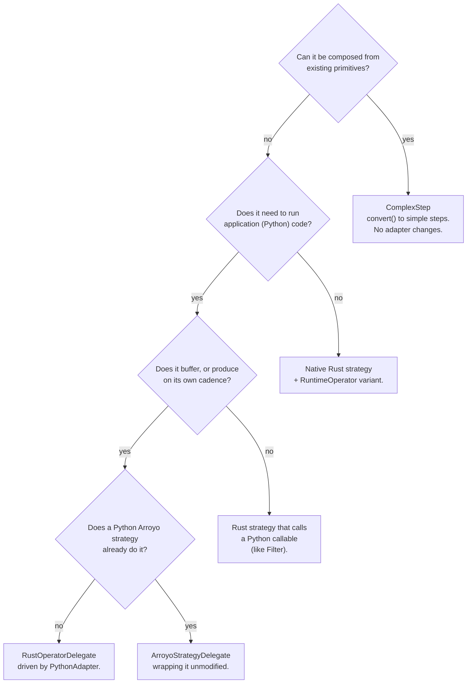

# Adding a step

End-to-end procedure for adding a new step to the pipeline DSL and implementing it in the
Rust runtime. Read [Messages → rules for step authors](../rust-arroyo/messages.md#rules-for-step-authors)
first; everything below assumes them.

## 0. Decide what you are actually adding

Cheapest first. Only go down the list if the option above genuinely cannot express it.



A `ComplexStep` costs nothing outside the DSL and is the right answer more often than it
looks. A new **primitive** is the expensive case: it is a breaking change to every adapter
(see [Contracts](../contracts.md#extending-the-dsl)). Everything below covers that case.

## Touchpoints

| # | What | Where |
| --- | --- | --- |
| 1 | New `StepType` member | `sentry_streams/pipeline/pipeline.py:58` |
| 2 | Step dataclass | `sentry_streams/pipeline/pipeline.py` (next to `Map:427`, `Filter:444`) |
| 3 | DSL entry point, if not reachable via `apply()` | `Pipeline.apply:128`, `.sink:136`, `.broadcast:142`, `.route:154` |
| 4 | Abstract method on the adapter interface | `sentry_streams/adapters/stream_adapter.py:44` |
| 5 | Dispatch branch | `RuntimeTranslator.translate_step`, `stream_adapter.py:173` |
| 6 | Implementation in **every** adapter | `adapters/arroyo/rust_arroyo.py:288+`, `adapters/arroyo/adapter.py`, `dummy/dummy_adapter.py` |
| 7 | New `RuntimeOperator` variant | `src/operators.rs:33` |
| 8 | Arm in the operator dispatch | `src/operators.rs:125` (`build`) |
| 9 | The strategy itself | new `src/<your_step>.rs`, registered in `src/lib.rs` |
| 10 | Tests | `tests/` (Python), `#[cfg(test)]` in your module (Rust) |

You do **not** need to touch `sentry_streams/config.json`: `steps_config` allows additional
properties, so new per-step config keys are legal without a schema change.

## 1. Choose the base class

| Base | Use for |
| --- | --- |
| `Transform[TIn, TOut]` | A 1:1 or 1:N transformation |
| `Filter[TIn]` | Same type in and out, may drop |
| `Sink[TIn]` | Terminates a branch |
| `Source[TOut]` | Roots a pipeline |
| `WithInput[TIn]` | Branching or control steps that fit none of the above |
| `ComplexStep[TIn, TOut]` | Sugar over the above; implement `convert()` |

## 2. Declare the step in the DSL

```python
@dataclass
class Dedupe(Transform[TIn, TIn], Generic[TIn]):
    """One-line docstring: this is the reference documentation for the step."""

    window_size: int = 1000
    step_type: StepType = StepType.DEDUPE

    def override_config(self, loaded_config: Mapping[str, Any]) -> None:
        if "window_size" in loaded_config:
            self.window_size = loaded_config["window_size"]

    def validate(self) -> None:
        if self.window_size <= 0:
            raise InvalidPipelineError(f"{self.name}: window_size must be positive")
```

Notes that save time:

- It is a `@dataclass`, so fields with defaults must follow fields without them — including
  the inherited ones. `step_type` always carries a default.
- Generics are load-bearing: `Pipeline[TOut]` is re-typed by `apply()`, so declaring the wrong
  parameters shows up as a chaining type error in application code, not here. Run
  `make typecheck`, which includes `tests/test_mypy_integration.py`.
- `override_config` reads only keys it understands; `validate()` runs after it, never before.
- Put the per-primitive documentation in the docstring. The architecture docs deliberately do
  not duplicate it.

## 3. Wire the translator

Add the `StepType` member, then a branch in `RuntimeTranslator.translate_step`. The dispatch
ends in `assert_never(step_type)`, so mypy fails until you do — that is the intended
enforcement, not an obstacle to work around.

## 4. Implement it in every adapter

Add the abstract method to `StreamAdapter`, then implement it everywhere. An adapter that will
not support the step declines explicitly:

```python
def dedupe(self, step: Dedupe[Any], stream: Route) -> Route:
    logger.info(f"Adding dedupe: {step.name} to pipeline")
    raise NotImplementedError
```

In `RustArroyoAdapter`, follow the five-step pattern in
[the adapter in depth](../rust-arroyo/adapter.md#what-each-method-does). The step that is easy
to forget is **closing the open transformation chain**, which every non-map method must do
before adding its own operator:

```python
def dedupe(self, step: Dedupe[Any], stream: Route) -> Route:
    step_config = self.__get_step_config(step.name)
    step.override_config(step_config)
    step.validate()
    self.__close_chain(stream)          # required — see Contracts
    self.get_consumer(stream.source).add_step(
        RuntimeOperator.Dedupe(stream, step.name, step.window_size)
    )
    return stream
```

## 5. Implement the Rust strategy

Add the `RuntimeOperator` variant (`src/operators.rs:33`) and its arm in `build`
(`src/operators.rs:125`), then write the strategy. This skeleton applies all six step-author
rules; `src/filter_step.rs` is the closest real example.

```rust
use crate::messages::RoutedValuePayload;
use crate::pipeline_stats::get_stats;
use crate::routes::{Route, RoutedValue};
use crate::utils::traced_with_gil;
use sentry_arroyo::processing::strategies::{
    CommitRequest, ProcessingStrategy, StrategyError, SubmitError,
};
use sentry_arroyo::types::{InnerMessage, Message};
use std::time::{Duration, Instant};

pub struct MyStep {
    pub next_step: Box<dyn ProcessingStrategy<RoutedValue>>,
    pub route: Route,
    pub step_name: String,
}

impl ProcessingStrategy<RoutedValue> for MyStep {
    fn poll(&mut self) -> Result<Option<CommitRequest>, StrategyError> {
        // If this step buffers: emit anything ready here, and release any watermark
        // whose offsets the emitted output now covers (rule 2), before polling on.
        self.next_step.poll()
    }

    fn submit(&mut self, message: Message<RoutedValue>) -> Result<(), SubmitError<RoutedValue>> {
        // Rule 1: not our branch — forward untouched, no GIL.
        // Rule 2: forward watermarks too, UNLESS this step buffers messages, in which
        //         case hold them until the buffered work is out.
        if self.route != message.payload().route || message.payload().payload.is_watermark_msg() {
            return self.next_step.submit(message);
        }

        // Rule 3: handle every payload variant you support; fail loudly on the rest.
        let RoutedValuePayload::PyStreamingMessage(ref streaming_msg) = message.payload().payload
        else {
            unreachable!("watermarks are forwarded above")
        };

        let stats = get_stats();
        stats.step_exec(&self.step_name);
        let start = Instant::now();

        // Rules 4 and 5: only take the GIL if you must read a Python payload,
        // and take it once around the largest reasonable unit of work.
        // let outcome = traced_with_gil!(|py| { ... });

        stats.step_timing(&self.step_name, start.elapsed().as_secs_f64());

        // To send a message to the DLQ instead of forwarding it:
        //
        //   match &message.inner_message {
        //       InnerMessage::BrokerMessage(broker_message) => {
        //           stats.step_error(&self.step_name);
        //           return Err(SubmitError::InvalidMessage(broker_message.into()));
        //       }
        //       // No offset to attribute the failure to — see Guarantees.
        //       InnerMessage::AnyMessage(..) => panic!("cannot DLQ an AnyMessage in {}", self.step_name),
        //   }

        self.next_step.submit(message)
    }

    fn terminate(&mut self) {
        self.next_step.terminate()
    }

    fn join(&mut self, timeout: Option<Duration>) -> Result<Option<CommitRequest>, StrategyError> {
        // If this step buffers: flush in-flight work and release held watermarks here.
        self.next_step.join(timeout)
    }
}
```

If the step needs to run a Python *step* rather than a Python function — it buffers, or has its
own cadence — do not write a strategy. Implement a `RustOperatorDelegate` instead and let
`RuntimeOperator::PythonAdapter` drive it; see
[The Python operator](../rust-arroyo/python-operator.md).

## 6. Instrument it

Use `get_stats()` (`src/pipeline_stats.rs`): `step_exec` on entry, `step_timing` with the
elapsed seconds, `step_error` when the step rejects a message. Python-side steps are wrapped
automatically by the adapter. Keeping both sides identical is the point — see
[Metrics](../rust-arroyo/metrics.md#deliberate-symmetry-across-the-boundary).

## 7. Configure it

Add the keys your step reads to `override_config`, and document them in
[Deployment configuration](../../reference/deployment-config.md#per-step-configuration). No
JSON-schema change is needed. If the step is not a map, remember it will close the enclosing
transformation chain, which can split a segment a user thought was contiguous.

## 8. Test it

| Level | Where | What it gives you |
| --- | --- | --- |
| Rust unit | `#[cfg(test)]` in your module | `fake_strategy::FakeStrategy` collects what you forward; `assert_messages_match` compares; `testutils::{build_routed_value, make_lambda, import_py_dep}` build inputs and Python callables |
| Python unit | `tests/pipeline/`, `tests/adapters/` | DSL construction, config overrides, translation |
| Type | `make typecheck` | Chaining types; `assert_never` exhaustiveness |
| Integration | `integration_tests/` | The step inside a running consumer |

Write at least: route mismatch forwards untouched; a watermark behaves correctly (forwarded,
or held and released); each supported payload variant; and the unsupported variant fails the
way you intended.

## Checklist

- [ ] `StepType` member added, translator branch added, `assert_never` satisfied
- [ ] Step dataclass with docstring, `override_config`, `validate`
- [ ] Every adapter implements the method, or raises `NotImplementedError`
- [ ] Non-map adapter methods close the transformation chain first
- [ ] `RuntimeOperator` variant + `build` arm
- [ ] Route checked first, without the GIL
- [ ] Watermarks forwarded, or held and released on flush
- [ ] Every payload variant handled or loudly rejected
- [ ] `step_exec` / `step_timing` / `step_error` emitted
- [ ] Rust and Python tests, `make typecheck`, `make tests-streams`, `make tests-rust-streams`
