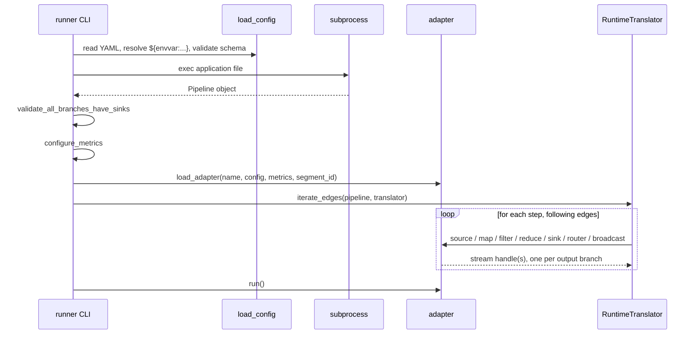

# Pipeline DSL and runner

The layer product teams write against, and the component that turns what they wrote into
a running process. The conceptual model is in [The model](./README.md#the-model); the per-primitive
reference is in the docstrings of `sentry_streams/pipeline/pipeline.py`.

## Principles

**The pipeline is a description, not a program.** Building a `Pipeline` object executes
no streaming logic and allocates no runtime resource. It produces a graph: a map of named
steps and the edges between them.

**Steps are runtime agnostic.** A primitive describes an intent and never how the intent
is fulfilled. The same `Map` may end up as a native Rust `RunTask`, as a link in a fused
chain, or as a function executed in a pool of worker processes. Product code does not
change.

**Names are the contract with the deployment config.** Every step has a name, unique
within the pipeline, and that name is the key the config addresses it by. This is the
only coupling between the application file and its configuration.

**Steps are typed.** `Pipeline[TOut]` carries the type of the messages flowing out of the
last step added, and each primitive is generic in its input and output types. Chaining a
step whose input type does not match is a type error — which catches, for instance,
sinking parsed objects into a Kafka sink without a serializer in between. What this
requires of a new step class is in
[Adding a step](./guides/adding-a-step.md#2-declare-the-step-in-the-dsl).

## Chaining

A pipeline starts from a source and grows by chaining — see the canonical example in
[The model](./README.md#the-primitives). `apply()` registers a step and an edge from the
previous one, then returns the same pipeline object re-typed to the new output type.
`sink()` does the same and closes the pipeline: nothing can be appended after it.

Branching works by building sub-pipelines separately and handing them to a branching
step:

```python
branch_a = branch("a").apply(Map("map_a", function=f)).sink(StreamSink("sink_a", stream_name="a"))
branch_b = branch("b").apply(Map("map_b", function=g)).sink(StreamSink("sink_b", stream_name="b"))

pipeline.route(
    "router",
    routing_function=pick_branch,
    routing_table={BranchKey.A: branch_a, BranchKey.B: branch_b},
)
```

A sub-pipeline built with `branch()` has a `Branch` step as its root rather than a source.
When handed to `route()` or `broadcast()`, its steps and edges are merged into the parent
graph with the branching step as the parent of each branch root. Because the branches must
be complete before they can be merged, a router or broadcast also closes the pipeline it
is added to.

The result, in all cases, is a single `Pipeline` object holding a flat map of steps plus
the incoming and outgoing edges. Downstream, nothing needs to know in which order the
chaining calls were made.

## Configuration overrides

Every step declares defaults in code and can have them overridden by the deployment
config, through two hooks on the base `Step` class:

- `override_config(loaded_config)` — the step picks the keys it understands out of the
  config mapping for its own name and mutates itself accordingly.
- `validate()` — checks the step is coherent. Called explicitly *after* the override,
  because a step that was valid as written may not be valid once overridden.

Both are invoked by the adapter at translation time, immediately before the step becomes
a runtime primitive. That placement is an invariant: see
[Contracts](./contracts.md#configuration).

What is overridable and what is not follows one line: the values that change the *meaning*
of the program — the functions, the graph shape, the types — belong to the application.
Everything about *where and how much* — topics, brokers, consumer groups, batch sizes,
parallelism — is overridable. Which keys each step reads is documented in
[Deployment configuration](../reference/deployment-config.md#per-step-configuration).

## Complex steps

Some primitives are not runtime operations at all, but recurring combinations of them.
`Parser` decodes bytes and validates them against the `sentry-kafka-schemas` schema for a
message type; `Serializer` does the reverse; `ParquetSerializer` turns a batch into a
Parquet buffer; `Reducer` is a friendlier spelling of `Aggregate`.

These are `ComplexStep`s. Each implements `convert()`, returning a plain simple step —
usually a `Map` with a suitable function partial-applied. The translator calls `convert()`
transparently, so by the time the adapter sees the pipeline, a `Parser` is just a `Map`.

The indirection does two things. It keeps the set of operations an adapter must implement
small: an adapter supports maps and filters and reduces, not parsers and serializers. And
it leaves room for an adapter to do better than the generic conversion, through
`complex_step_override()`: an adapter with a native, faster implementation of a complex
step declares it and receives the original step instead of its conversion. Adapters that
do not care return an empty mapping.

## From pipeline to consumer

The runner is deliberately thin: the intelligence about a runtime lives in its adapter,
and the intelligence about the application lives in the pipeline.



| Component | Anchor | Note worth knowing |
| --- | --- | --- |
| `load_config` | `pipeline/config.py` | Resolves `${envvar:NAME}`, validates against `sentry_streams/config.json` |
| `_load_pipeline` | `runner.py` | Runs the application file **out of process**, so module-scope imports cannot pollute the runner. Product exceptions propagate, so a Sentry SDK the application initialised can capture them |
| `validate_all_branches_have_sinks` | `pipeline/validation.py` | A dangling branch is nearly always a bug, and far cheaper to catch here than after startup |
| `load_adapter` | `adapters/loader.py` | Resolves the adapter name to a class; with a segment id, narrows the config first so an adapter only ever sees its own portion |
| `RuntimeTranslator` | `adapters/stream_adapter.py:162` | The only place mapping step type to adapter method. Ends in `assert_never`, so a new `StepType` is a type error until handled |
| `iterate_edges` | `pipeline/pipeline.py` | The data-flow traversal. Branching steps return several handles, each pushed back into the working set |
| `adapter.run()` | per adapter | Blocks until shutdown |

The handle is opaque to the runner — a generic parameter of the adapter. For the Rust
Arroyo adapter it is a `Route`; for another runtime it could be a native stream object.
