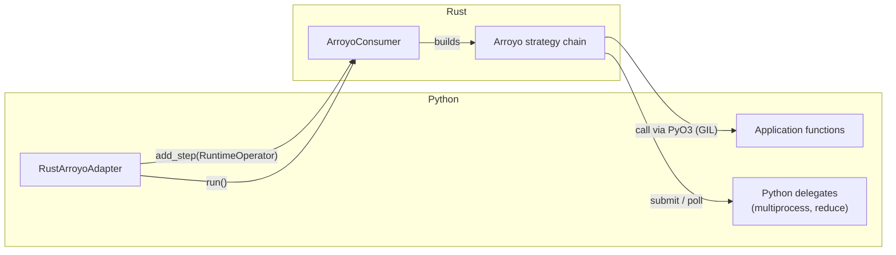
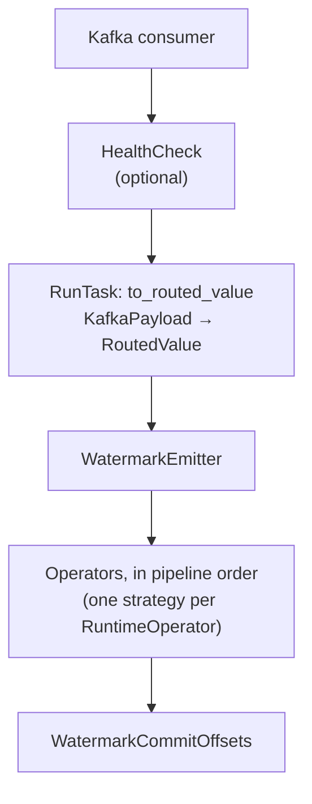

# The Rust Arroyo adapter

The `rust_arroyo` adapter runs a pipeline as a single Arroyo consumer implemented in
Rust. It is the adapter used in production.

- [Messages](./messages.md) — the message model and the rules it imposes on steps.
- [The Python operator](./python-operator.md) — embedding Python strategies in the chain.
- [The adapter in depth](./adapter.md) — chaining, fusion, segments.
- [Metrics](./metrics.md) — how both sides report.

## Execution model

The consumer is written in Rust on top of `rust-arroyo` and exposed to Python as an
extension module built with PyO3 and Maturin. The process is a Python process: it starts
as Python, imports the extension module, and hands control to Rust.

This gives an inversion of control that explains most of the rest of this directory:

- **Python builds.** The adapter constructs a description of the pipeline and hands it to
  Rust step by step.
- **Rust runs.** Once `run()` is called, the Rust `StreamProcessor` owns the main loop: it
  polls Kafka, submits messages through the strategy chain, and commits.
- **Rust calls back into Python.** The application logic — map functions, filter
  predicates, routing functions — lives in Python memory. Every time a message reaches one
  of those steps, Rust acquires the GIL and calls into Python.

## Building the consumer

`ArroyoConsumer` is a `pyclass`. The adapter creates one per source, then calls
`add_step()` once per operator, in the order a message would traverse them.

The values passed to `add_step()` are `RuntimeOperator`s (`src/operators.rs`): a Rust enum,
also exported to Python, whose variants are the operations the runtime knows how to
execute. They are **descriptors, not strategies** — they say what to build and carry the
parameters, including a reference to a Python callable where relevant.

`RuntimeOperator`s do not map one-to-one onto DSL steps; the adapter fuses consecutive maps
into one operator. See [the adapter in depth](./adapter.md).

The whole pipeline must be handed over before anything is constructed, because Arroyo
strategies are built back to front — each strategy owns the next. That is why the consumer
accumulates a list of operators and only assembles the chain in `run()`, and why it must
keep the descriptors rather than consuming them: the chain is rebuilt from them on every
rebalance, through a strategy factory.

## What runs where

The rule governing this split is **any primitive that can be executed entirely in Rust is
implemented in Rust**, because crossing the language boundary costs a GIL acquisition,
serialises the step against every other Python interaction in the process, and may cost a
copy.

| Concern | Rust | Python |
| --- | --- | --- |
| Kafka consumption, offset management, rebalancing | ✅ | |
| Strategy chain, backpressure, DLQ routing | ✅ | |
| Watermark emission and the commit policy | ✅ | |
| Route matching and branch dispatch | ✅ | |
| Batch step, header filter, broadcast | ✅ | |
| Kafka producer sink, GCS sink, DevNull sink | ✅ | |
| Map and filter functions written by applications | invoked from | executed in |
| Routing functions | invoked from | executed in |
| Parsing, serialisation, schema validation | | ✅ (as maps) |
| Windowed reduce / aggregate | wrapper | strategy |
| Multiprocessing | wrapper | strategy |
| Building the pipeline, reading the config | | ✅ |
| Metrics emission | ✅ | ✅ |

The two wrapper rows are pre-existing Python Arroyo strategies that were not
reimplemented; they are embedded through [the Python operator](./python-operator.md).

There is a middle ground worth knowing about: a function written in Rust and exposed to the
pipeline as if it were a Python callable (the `rust_transforms` example). It is still
invoked through PyO3, but releases the GIL internally for the duration of the work.

## The strategy chain

When `run()` is called, the consumer builds an Arroyo strategy chain and hands it to a
`StreamProcessor` bound to the source topic. The chain is assembled from the end backwards;
a message traverses it in this order:

| Stage | Role |
| --- | --- |
| **HealthCheck** | Touches a file on every poll for the Kubernetes liveness probe. Added only when enabled in the adapter config |
| **Conversion** | Turns the `KafkaPayload` into a `RoutedValue`: a payload plus the `Route` saying which branch it belongs to. The payload at this point is a `RawMessage` with the broker bytes, headers, timestamp and the logical schema name |
| **WatermarkEmitter** | Records the offsets of everything passing through and periodically injects a watermark carrying them |
| **Operators** | The pipeline proper. Each checks the message's route against its own and passes it straight through on a mismatch |
| **WatermarkCommitOffsets** | Commits the offsets a watermark carries, once it has seen that watermark arrive from every branch |

A dead letter queue policy can be attached to the processor, in which case a message
rejected as invalid by a step is produced to the DLQ topic instead of stopping the
consumer. The full failure policy is in [Guarantees](../guarantees.md).

The last two stages exist because Arroyo has no notion of branches. That is the subject of
[Messages](./messages.md).

## Entry points

Two executables converge here: the **Python CLI** (`sentry_streams.runner:main`), which
builds the runtime and calls `run()` from Python, and the **Rust CLI**, which embeds a
Python interpreter, calls the loading function to get the built runtime back as a
`Py<PyAny>`, and calls `run()` from Rust. Keeping loading and running separate is therefore
an [invariant](../contracts.md#the-runner).
