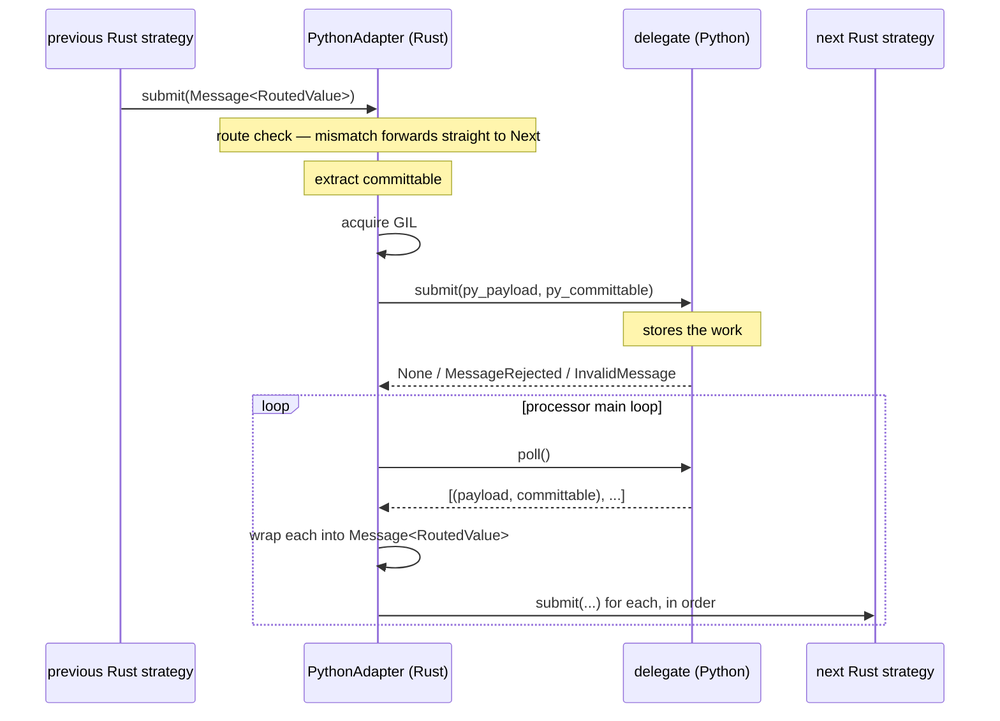
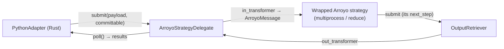

# The Python operator

Most Python in this runtime is a function called from a Rust strategy: the map, the filter,
the routing function. The Python operator is for the cases where that is not enough — where
the thing that has to run in Python is not a function but a *step*, with its own buffering,
its own timing, and its own output cadence.

Two such steps exist today, both pre-existing Python Arroyo strategies that were not
reimplemented in Rust: the **multiprocessing** step and the **windowed reduce**.

## The delegate interface

`RuntimeOperator::PythonAdapter` builds `PythonAdapter` (`src/python_operator.rs`), a Rust
Arroyo strategy holding a reference to a Python object and delegating message processing to
it. To the rest of the chain it is an ordinary `ProcessingStrategy<RoutedValue>`: it can be
wired between any two strategies, it propagates backpressure, it participates in commits.

What it delegates to is not an Arroyo strategy, and that is the crux of the design. An
Arroyo strategy hands its results to the next strategy itself, which cannot work across the
boundary: the next strategy is a Rust object and a Python object cannot hold or call it. So
the Python side implements a deliberately simpler interface, `RustOperatorDelegate`:

| Method | Contract |
| --- | --- |
| `submit(message, committable)` | Accept work. It does not process, it stores |
| `poll()` | Do the processing and **return** the results, as `(message, committable)` pairs |
| `flush(timeout)` | Finish everything in flight, return the results, release resources |

Rust forwards whatever `poll` returned to the next strategy, so the delegate never needs a
reference to anything downstream.

Splitting "accept" from "produce" also makes the interface inherently asynchronous: a
delegate can be 1:1, 1:N, N:1 or N:0 — a reduce accepts a hundred messages and produces
one, a multiprocess pool accepts a batch and produces results several polls later. None of
that is expressible in a signature that must return one result per input.

A delegate is created by a `RustOperatorFactory`, not passed in directly, because Arroyo
tears down and rebuilds its strategy chain on every rebalance. The factory is also where
state that must survive a rebuild lives — a pre-initialised process pool, for instance,
far too expensive to recreate on every partition assignment.

## Data flow

Properties of that flow which are not obvious from the diagram:

- The GIL is acquired **once** per `submit`, and both conversions happen inside it: payload
  to a Python object, committable to a dict keyed by `(topic, partition)`. A `PyAnyMessage`
  or `RawMessage` is already a `pyclass`, so this is a reference clone, not a copy.
- Exceptions out of `submit` are the delegate's control channel:

  | Exception | Meaning | Effect |
  | --- | --- | --- |
  | `MessageRejected` | "I am full" | Arroyo backpressure; the message is handed back to be retried |
  | `InvalidMessage` | "this cannot be processed" | Offset and partition are read off the exception, message goes to the DLQ |
  | anything else | a bug in the delegate | panic — there is no sensible interpretation, and continuing would silently drop data |

- On the way out, the payload decides the variant: a `PyWatermark` becomes a watermark
  message, anything else a `PyStreamingMessage`. **The route attached is the operator's
  own** — the delegate has no notion of routes and does not need one.
- Results are drained into the next strategy one at a time, polling it between
  submissions. If it rejects one, that message goes back to the front of the queue and the
  drain stops, preserving order and propagating backpressure upstream. `join` follows the
  same path through `flush`, with a deadline.
- The committable a delegate returns is *its* choice, not an echo of the input: a reduce
  that merged a hundred messages returns their combined committable. The messages produced
  are Arroyo "any messages" rather than broker messages, which is why a failure downstream
  of this operator cannot be attributed to a specific offset.

## Wrapping a whole Arroyo strategy

The delegate interface is small enough to implement directly — `SingleMessageOperatorDelegate`
is a helper for the trivial 1:1 synchronous case. But both real users wrap an existing
Python Arroyo strategy, unmodified, via `ArroyoStrategyDelegate`, which bridges three
mismatches:

| Mismatch | Bridge |
| --- | --- |
| The strategy pushes; the delegate returns | `OutputRetriever`, a minimal Arroyo strategy given to the wrapped strategy as its next step. It forwards nowhere and collects what it receives into a list, which `poll` hands back |
| The strategy speaks Arroyo messages; the runtime speaks pipeline messages | Two transformer functions, in and out. The output transformer is also where Arroyo-specific payloads like `FilteredPayload` are dropped |
| Watermarks must not overtake the data | The delegate intercepts watermarks, holds them, and releases one only once the output produced covers the offsets it carries |

## The multiprocess step

The main user of this machinery is `RunTaskWithMultiprocessing`, Arroyo's pool-based
transformation strategy. The adapter reaches for it when a segment is configured with
`multi_process` parallelism: the fused chain of maps becomes the function executed in the
pool, and the whole strategy is wrapped in a delegate.

One constraint shapes the conversion. `RunTaskWithMultiprocessing` moves payloads to worker
processes through shared memory, which means pickling them — and the Rust message types are
`pyclass`es, which are not picklable.

That is why the pipeline messages Python code sees are the `Message` wrappers (`PyMessage`,
`PyRawMessage`, in `sentry_streams/pipeline/message.py`) rather than the Rust types
directly. The wrappers hold plain Python fields, pickle cleanly, and build the underlying
Rust object lazily on first use, caching it. The input transformer unwraps a Rust message
into a wrapper; the output transformer calls `to_inner()` to get the Rust object back. The
same wrappers are what make the payload generic to the type checker, which `pyclass` types
cannot be.

Worker processes are a fresh interpreter each, so the pool is created with an initializer
that reconfigures metrics in every worker — see [Metrics](./metrics.md#multiprocessing).
