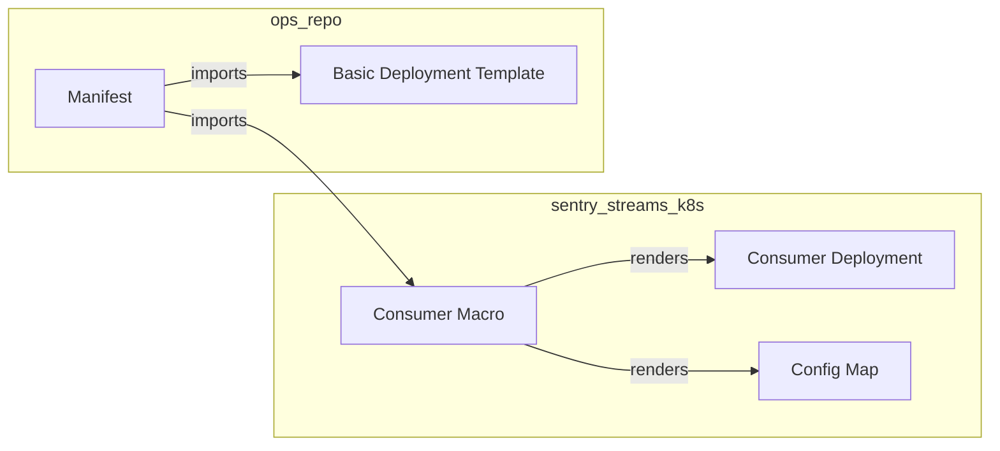

# Sentry Streams K8s

Kubernetes integration for Sentry Streams.

Sentry Streams contains the streaming platform. That is everything that runs
the streaming applications. Sentry Streams is agnostic to the way the application
is deployed in production or in any environment.

This package instead provides the automation and the infrastructure to deploy
Sentry Streams in a Kubernetes environment.

At the moment it targets Sentry production environment that is based on
[sentry-kube](https://github.com/getsentry/sentry-infra-tools), though in the
future we expect to have something more Sentry agnostic like Helm charts and
a Kubernetes operator.

## The Consumer Macro

The main component is the Consumer macro. This is a sentry-kube external macro
that can be used inside the sentry-kube jinja template in the ops repo.
This takes the basic deployment infrastructure (application specific) and
fills it with containers and other resources to run the streaming platform.

The system to render a deployment would work this way:

- The Consumer Macro renders all the Kubernetes resources to run the streaming
platform.
- The application manifest is responsible to create all the resources needed
  to run the application (like service accounts or additional config maps)
- The basic structure of the deployment template is application specific, it
  contains settings like labeling scheme and nodepool selectors. We expect these
  to be provided to the macro by the application in the form of the deployment
  template.
